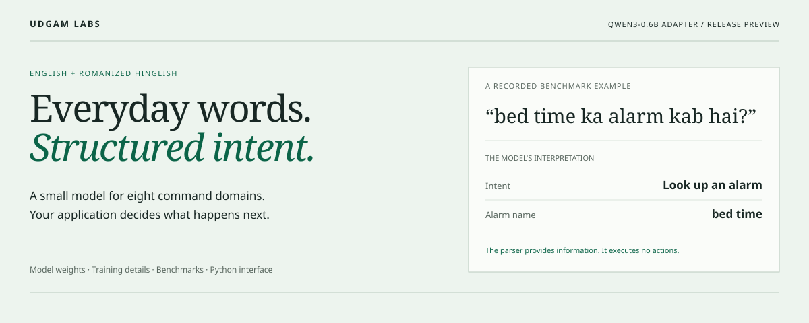
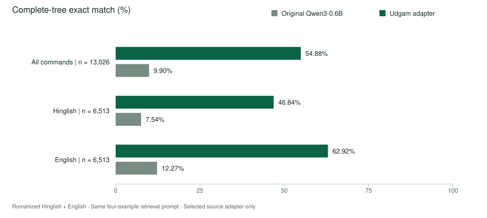

<p align="left"><strong>UDGAM LABS</strong> · A small model for Hinglish commands</p>



# Hinglish Commands

An English and Romanized Hinglish command parser built by **Udgam Labs**, a frontier technology lab in India. It turns short requests into an intent and labelled details that a developer can use inside an app.

For example, **“bed time ka alarm kab hai?”** becomes an alarm lookup with **“bed time”** as the alarm name. Your app handles the lookup, permissions and response. The model does not set alarms, send messages or take actions.

**Release preview:** these files are being prepared for review. Private staging repositories are [GitHub: UdgamLabs/hinglish-commands-0.6b](https://github.com/UdgamLabs/hinglish-commands-0.6b) and [Hugging Face: UdgamLabs/hinglish-commands-0.6b](https://huggingface.co/UdgamLabs/hinglish-commands-0.6b). Public release is pending; repository access may be restricted until publication.

[What it does](#what-it-does) · [Recorded examples](#see-the-difference) · [Benchmarks](#what-improved) · [Get started](#get-started) · [Limits](#know-the-limits) · [Licences](#licences-and-credit)

## What it does

The model identifies **what someone is asking for** and **which words describe the details**. It supports the eight command domains in the Hinglish-TOP benchmark:

**Alarms · Events · Messaging · Music · Navigation · Reminders · Timers · Weather**

This is a task-specific LoRA adapter for [Qwen3-0.6B](https://huggingface.co/Qwen/Qwen3-0.6B). We trained it on human-labelled English/Hinglish command pairs and kept the training recipe, comparisons and mistakes available for review.

- **For people exploring the model:** open the [visual walkthrough](docs/index.html) for recorded examples and a plain-language explanation.
  GitHub displays HTML as source. To view it, download this repository and open `docs/index.html`, or run `python -m http.server 8876 --bind 127.0.0.1 --directory docs` from the checkout and visit `http://127.0.0.1:8876/`.
- **For developers:** use the [Python quickstart](docs/QUICKSTART.md), [integration guide](docs/INTEGRATION.md), or the local browser demo.
- **For researchers:** start with the [benchmark report](docs/BENCHMARKS.md) and [model card](https://huggingface.co/UdgamLabs/hinglish-commands-0.6b).

## See the difference

These are **saved predictions from the completed benchmark**, not a live demo. The examples illustrate particular outcomes; they are not a representative sample.

### A request it got right

> bed time ka alarm kab hai?

The tuned model identifies an **alarm lookup** and the alarm name **“bed time”**. Its full output matches the human benchmark reference.

```text
[IN:GET_ALARM [SL:ALARM_NAME bed time ] ka alarm kab hai? ]
```

The original model produced `[IN:GET_ALARM Mera alarm kab hai? ]`, missing the name and changing the wording. Recorded example: `htop-test-004074-hinglish`.

### A request it still got wrong

> mujhe subah 9 baje ke liye jaga do

The reference asks to **create an alarm**. The tuned model incorrectly predicts **an estimated departure time**:

```text
[IN:GET_ESTIMATED_DEPARTURE mujhe [SL:DATE_TIME subah 9 baje ke liye ] jaga do ]
```

The original model got this one right. Recorded example: `htop-test-003763-hinglish`. A correctly formatted result can still have the wrong meaning.

The [interactive walkthrough](docs/index.html#examples) shows the saved output, its ordered JSON representation and the unchanged human reference. A parser proposes an interpretation; your application must decide whether to use it.

## What improved

**54.88% of complete command trees matched the reference, compared with 9.90% for the original Qwen3-0.6B.** That is a **44.98 percentage-point gain** on this specific held-out benchmark.



| Test view | Commands | Original Qwen3-0.6B | Udgam adapter |
|---|---:|---:|---:|
| English + Romanized Hinglish | 13,026 | 9.90% | **54.88%** |
| Romanized Hinglish | 6,513 | 7.54% | **46.84%** |
| English | 6,513 | 12.27% | **62.92%** |

“Exact match” means the **entire ordered command tree** matches the inherited human label, including its intents, slots and copied text, after spacing normalization. It is stricter than getting just the main intent right. Both models used the same four retrieved training examples and generation settings.

The tuned model matched **7,149 of 13,026** labels and missed **5,877**. The paired 95% confidence interval for the overall gain is **43.93–46.03 percentage points**, using 2,000 resamples over 6,302 normalized English-source clusters. The bilingual rows are paired, not 13,026 independent requests.

These scores belong to the **selected source adapter**, evaluated with the pinned base model. They do not establish production reliability, general Hindi ability, voice performance or mobile-device suitability. The [benchmark report](docs/BENCHMARKS.md) covers all comparators, deduplication, uncertainty and the test protocol.

## Get started

The Python package is named `udgam-hinglish`. Install it **from this source checkout**; it is not advertised as a PyPI release.

```bash
# Run inside a local checkout of this repository.
python -m venv .venv
source .venv/bin/activate
python -m pip install -e '.[inference]'
```

Download the reviewed **adapter package** from the Hugging Face release once it is available. Keep the whole package, including its configuration, tokenizer, schema and retrieval data.

```python
from udgam_hinglish import CommandParser

# Replace this with your downloaded adapter-package directory.
parser = CommandParser.from_local("/path/to/adapter-package", device="auto")
result = parser.parse("bed time ka alarm kab hai?")

print(result["status"])
print(result["tree"])       # Ordered, nested labels and text.
print(result["checks"])     # Structural checks, not semantic certainty.
```

Local loading is offline by default and requires the exact base model to be cached. The [quickstart](docs/QUICKSTART.md) explains explicit first-time downloads, pinning the Hugging Face release commit, device selection and requirements.

To try your own text in the local browser demo:

```bash
udgam-hinglish demo --model-dir /path/to/adapter-package
```

The local demo runs real inference on your computer. The [static walkthrough](docs/index.html) only displays recorded examples.

## Know the limits

- **Language:** English and Romanized Hinglish were evaluated. Hindi written in Devanagari, other Indian languages and long conversations were not established by this test.
- **Task:** eight benchmark command domains. It is not a general assistant, translator, speech recognizer or source of current information.
- **Correctness:** labels and copied text can be wrong even when the output passes format checks. Require confirmation for consequential actions; handle unsupported requests and failures explicitly.
- **Integration:** dates such as “kal dopahar” remain text spans. Your app must resolve dates, contact names and permissions and execute any action.
- **Evidence:** this is a public benchmark; unknown overlap with the base model’s pretraining data cannot be ruled out. Real user demand and real-world performance still need validation.
- **Hardware:** running locally needs the base model and a compatible inference environment. No low-end phone performance claim is made.

## Licences and credit

The work builds on **Qwen3-0.6B**, **Google’s Hinglish-TOP** and the underlying **TOPv2** work. Keep their original notices and attribution.

Proposed release terms are **CC BY-SA 4.0** for the adapter contribution and prepared/retrieval data, with Qwen and Google Apache notices preserved; **Apache 2.0** for Udgam-written code. The complete package is **not Apache-only**. Publication terms remain subject to the release review; see the [licence review](docs/LICENSES.md) and [model card](https://huggingface.co/UdgamLabs/hinglish-commands-0.6b).

## Explore the work

| Start here | What you will find |
|---|---|
| [Model card](https://huggingface.co/UdgamLabs/hinglish-commands-0.6b) | Intended use, model identity, training and limitations |
| [Benchmarks](docs/BENCHMARKS.md) | Before/after results and evaluation method |
| [Quickstart](docs/QUICKSTART.md) | Installation, model loading and local demo |
| [Integration guide](docs/INTEGRATION.md) | The Python interface and handling outputs |
| [Visual walkthrough](docs/index.html) | Recorded examples in plain language and JSON |
| [Udgam Labs](https://www.udgamlabs.com/) | The lab behind the experiment |

Built by [Udgam Labs](https://github.com/UdgamLabs). We welcome reproducible bug reports and contributions that make this narrow task more useful. Please remove personal information from examples before sharing them.
